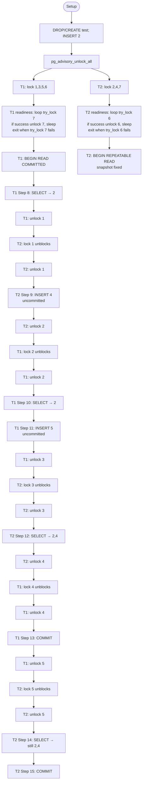

# Concurency in PostGres

**Advisory locks**
Advisory locks in PostgreSQL are application-level locks that you explicitly manage in your code... but these at the DB level rather than in app itself.

In test_transaction_isolation, we do 
    ```
    SELECT pg_advisory_lock(1);
    SELECT pg_advisory_lock(3);
    SELECT pg_advisory_lock(5);
    SELECT pg_advisory_lock(6);
    ```

pg_advisory_lock(1) is non-blocking for the caller — the calling session acquires the lock and immediately continues to the next statement. It does *not* block itself.

It only blocks other sessions that try to pg_advisory_lock(1) while you hold it. Those sessions will wait (hang) on that call until you release it with pg_advisory_unlock(1).
ie, the next  SELECT pg_advisory_lock(1) will block till pg_advisory_unlock(1) is done by the owning session.

