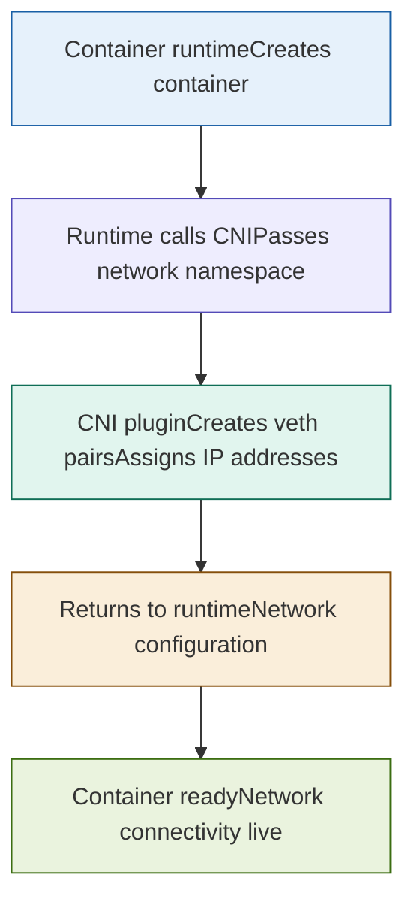

## What is this?
A set of docs explaining Container Network Interfaces (CNI)

### What CNI does 

1. Create veth pair (virtual ethernet)
2. Move one end to container netns
3. Assign IP from IPAM plugin
4. Set up routes and gateway
5. Configure DNS if specified
6. Return result to runtime

CNI is called by containerd when bringup up the containers in a pod.

Basically,

containerd → executes /opt/cni/bin/calico → returns IP config → containerd stores it
