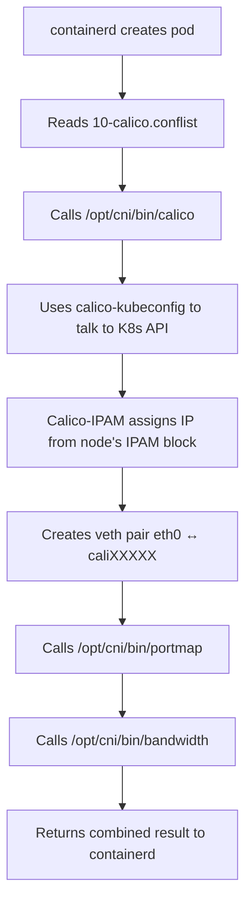

Exec into a node, and check the cni directory. 

[root@subramaniamv-tk5-k8-node-1-o0dp7x-zy8li9n3p2ggrqg4 net.d]# pwd
/etc/cni/net.d
[root@subramaniamv-tk5-k8-node-1-o0dp7x-zy8li9n3p2ggrqg4 net.d]# ls
00-multus.conf  10-calico.conflist  calico-kubeconfig  cni-conf.json  multus.d

CNIs are loaded in *lexigraphic order*, hence 00-multus.conf is first, then the calico one.

Let's look at the calico config first,
```[root@subramaniamv-tk5-k8-node-1-o0dp7x-zy8li9n3p2ggrqg4 net.d]# cat /etc/cni/net.d/10-calico.conflist
{
  "name": "k8s-pod-network",
  "cniVersion": "0.3.1",
  "plugins": [
    {
      "type": "calico",
      "log_level": "info",
      "log_file_path": "/var/log/calico/cni/cni.log",
      "datastore_type": "kubernetes",
      "nodename": "subramaniamv-tk5-k8-node-1-o0dp7x-zy8li9n3p2ggrqg4",
      "mtu": 0,
      "ipam": {
          "type": "calico-ipam",
          "assign_ipv4": "true",
          "assign_ipv6": "false"
      },
      "policy": {
          "type": "k8s"
      },
      "kubernetes": {
          "kubeconfig": "/etc/cni/net.d/calico-kubeconfig"
      }
    },
    {
      "type": "portmap",
      "snat": true,
      "capabilities": {"portMappings": true}
    },
    {
      "type": "bandwidth",
      "capabilities": {"bandwidth": true}
    }
  ]
```

This configures calico, to use it's own ipam and kubernetes modules, and the portmap and bandwitdth plugins.




Now, let's check the multus config.

## Multus Config

```[root@subramaniamv-tk5-k8-node-1-o0dp7x-zy8li9n3p2ggrqg4 net.d]# cat 00-multus.conf
{
        "cniVersion": "0.3.1",
        "name": "multus-cni-network",
        "type": "multus",
        "capabilities": {"bandwidth":true,"portMappings":true},
        "kubeconfig": "/etc/cni/net.d/multus.d/multus.kubeconfig",
        "delegates": [
                {"cniVersion":"0.3.1","name":"k8s-pod-network","plugins":[{"datastore_type":"kubernetes","ipam":{"assign_ipv4":"true","assign_ipv6":"false","type":"calico-ipam"},"kubernetes":{"kubeconfig":"/etc/cni/net.d/calico-kubeconfig"},"log_file_path":"/var/log/calico/cni/cni.log","log_level":"info","mtu":0,"nodename":"subramaniamv-tk5-k8-node-1-o0dp7x-zy8li9n3p2ggrqg4","policy":{"type":"k8s"},"type":"calico"},{"capabilities":{"portMappings":true},"snat":true,"type":"portmap"},{"capabilities":{"bandwidth":true},"type":"bandwidth"}]}
        ]
}```

## What is Multus?

Multus is a **meta-CNI plugin** that enables attaching **multiple network interfaces** to pods. It acts as a wrapper that:
1. Calls the "default" CNI plugin (Calico in this case)
2. Optionally attaches additional network interfaces via Network Attachment Definitions

## Your Multus Config (formatted)
```json
{
  "cniVersion": "0.3.1",
  "name": "multus-cni-network",
  "type": "multus",
  "capabilities": {
    "bandwidth": true,
    "portMappings": true
  },
  "kubeconfig": "/etc/cni/net.d/multus.d/multus.kubeconfig",
  "delegates": [
    {
      "cniVersion": "0.3.1",
      "name": "k8s-pod-network",
      "plugins": [
        {
          "type": "calico",
          "datastore_type": "kubernetes",
          "nodename": "subramaniamv-tk5-k8-node-1-o0dp7x-zy8li9n3p2ggrqg4",
          "log_level": "info",
          "log_file_path": "/var/log/calico/cni/cni.log",
          "mtu": 0,
          "ipam": {
            "type": "calico-ipam",
            "assign_ipv4": "true",
            "assign_ipv6": "false"
          },
          "policy": {
            "type": "k8s"
          },
          "kubernetes": {
            "kubeconfig": "/etc/cni/net.d/calico-kubeconfig"
          }
        },
        {
          "type": "portmap",
          "snat": true,
          "capabilities": {
            "portMappings": true
          }
        },
        {
          "type": "bandwidth",
          "capabilities": {
            "bandwidth": true
          }
        }
      ]
    }
  ]
}
```

## Configuration Breakdown

### Multus Metadata
```json
{
  "type": "multus",
  "kubeconfig": "/etc/cni/net.d/multus.d/multus.kubeconfig"
}
```
- **`type: multus`** → containerd calls `/opt/cni/bin/multus`
- Multus uses its kubeconfig to read Network Attachment Definitions from K8s API

### Delegates (Default Network)
```json
"delegates": [...]
```
- **Delegates** = the CNI plugins Multus will call
- In your case: **exactly the same as `10-calico.conflist`**
- This is the **default network** (eth0) that every pod gets

## How Multus Works

### Standard pod (no additional networks)
```
containerd → /opt/cni/bin/multus
   ↓
Multus reads delegates config
   ↓
Calls /opt/cni/bin/calico (creates eth0)
   ↓
Calls /opt/cni/bin/portmap
   ↓
Calls /opt/cni/bin/bandwidth
   ↓
Returns result to containerd
```

Result: Pod has **one interface (eth0)** with Calico networking

### Pod with additional networks

If you annotate a pod:
```yaml
apiVersion: v1
kind: Pod
metadata:
  name: multi-net-pod
  annotations:
    k8s.v1.cni.cncf.io/networks: sriov-net, macvlan-net
spec:
  containers:
  - name: app
    image: nginx
```

Then:
```
containerd → /opt/cni/bin/multus
   ↓
Multus creates eth0 via delegates (Calico)
   ↓
Multus reads NetworkAttachmentDefinition "sriov-net"
   ↓
Calls SR-IOV CNI → creates net1
   ↓
Multus reads NetworkAttachmentDefinition "macvlan-net"
   ↓
Calls macvlan CNI → creates net2
   ↓
Returns all interfaces to containerd
```

Result: Pod has **three interfaces**:
- `eth0` → Calico (default cluster network)
- `net1` → SR-IOV (high-performance dataplane)
- `net2` → macvlan (legacy VLAN access)


## File load order
```
/etc/cni/net.d/
├── 00-multus.conf        ← containerd reads this FIRST
├── 10-calico.conflist    ← ignored (Multus delegates handle it)
├── calico-kubeconfig
└── multus.d/
    └── multus.kubeconfig